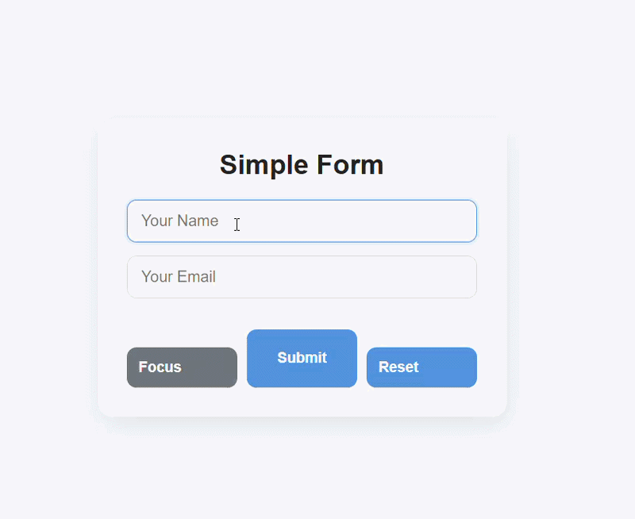

# React Simple Form

## Live Demo

👉 https://rodrigomzanetti.github.io/react-simple-form/

## Preview

## Overview

- React Simple Form App is a lightweight React application focused on handling user input using controlled components.
- The project demonstrates how to manage form state using useState and interact with DOM elements using useRef.
- It highlights best practices for handling form events, resetting inputs, and improving user experience with focus control.

  ## Features

- Controlled form inputs using React state
- Real-time state updates with onChange
- Input focus management using useRef
- Form submission handling with preventDefault
- Reset functionality to clear form fields
- Clean and responsive UI
- Component-based structure

  ## Technologies Used

- React: UI development and component logic
- JavaScript (ES6+): event handling and state management
- HTML5: semantic structure
- CSS3: styling and layout
- Vite: fast development and build tool

  ## Project Structure

react-simple-form/

- src/
- App.jsx: main component handling form logic
- App.css: styling
- main.jsx: application entry point
- index.html: root HTML file

## How to Run the Project

- Clone the repository
  git clone https://github.com/RodrigoMZanetti/react-simple-form.git
- Navigate to the project folder
  cd react-simple-form
- Install dependencies
  npm install
- Run the development server
  npm run dev
- Open in your browser
  http://localhost:5173

## Status

- Completed: core functionality implemented and deployed using GitHub Pages.

## Problem Solving

- One of the main challenges was implementing controlled inputs while managing multiple fields within a single state object. This was solved using dynamic keys based on the input name attribute.
- Another challenge was handling input focus programmatically. This was achieved using the useRef hook to directly access the DOM element.
- Additionally, managing form submission without reloading the page required understanding how to use preventDefault() correctly.

## What I Learned

During this project I practiced:

- Building controlled components with React
- Managing multiple inputs using a single state object
- Using useRef for DOM interaction (focus control)
- Handling form submission and reset behavior
- Understanding how React handles re-renders
- Structuring simple but scalable components

## Future Improvements

- Add validation for inputs (email format, required fields feedback)
- Display success/error messages after submission
- Improve accessibility (labels, aria attributes)
- Add animations and transitions
- Persist form data (localStorage)
- Refactor into smaller reusable components

## Author

Rodrigo M. Zanetti

- GitHub: https://github.com/RodrigoMZanetti
- LinkedIn: https://www.linkedin.com/in/rodrigomzanetti
